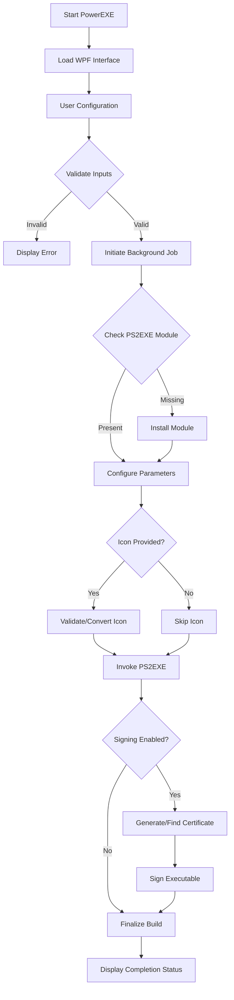

# PowerEXE

## PowerShell to Executable Compiler

PowerEXE is a Windows PowerShell-based utility designed to compile PowerShell scripts (`.ps1`) into standalone executable files (`.exe`). It utilizes a WPF-based graphical interface to manage compilation parameters, including icon embedding, metadata configuration, and code signing.

---

## Table of Contents

1. [Overview](#overview)
2. [System Requirements](#system-requirements)
3. [Key Capabilities](#key-capabilities)
4. [Installation and Usage](#installation-and-usage)
5. [Compilation Workflow](#compilation-workflow)
6. [Configuration Parameters](#configuration-parameters)
7. [Technical Notes](#technical-notes)
8. [License and Authorship](#license-and-authorship)

---

## Overview

PowerEXE serves as a frontend wrapper for the PS2EXE module, providing a streamlined user experience for converting administrative scripts into distributable binaries. The application handles dependency management automatically, including the installation of required NuGet providers and PowerShell modules.

The interface is built using Windows Presentation Foundation (WPF) with a dark-themed design optimized for reduced window footprint without sacrificing functionality.

---

## System Requirements

| Component | Requirement | Notes |
| :--- | :--- | :--- |
| **Operating System** | Windows 10 / 11 | Windows Server 2016 or later supported |
| **PowerShell Version** | Windows PowerShell 5.1 | PowerShell Core (6+) is not supported |
| **.NET Framework** | Version 4.5.2 or higher | Required for WPF and System.Drawing |
| **Permissions** | Standard User | Administrator rights required for code signing |
| **Internet Access** | Required (Initial Run) | Needed to install PS2EXE and NuGet providers |

---

## Key Capabilities

*   **Script Compilation:** Converts PowerShell scripts into native Windows executables.
*   **Icon Management:** Supports native `.ico` files and automatic conversion from `.png` sources.
*   **Metadata Embedding:** Allows configuration of product name, version, copyright, and company details.
*   **Code Signing:** Integrated support for generating self-signed certificates and signing the output binary.
*   **Background Processing:** Compilation jobs run in separate processes to maintain UI responsiveness.
*   **Auto-Dependency Installation:** Automatically installs the PS2EXE module if missing.

---

## Installation and Usage

### Installation

1.  Download the `PowerEXE.ps1` script to a local directory.
2.  Right-click the file and select **Properties**.
3.  If present, check **Unblock** in the General tab and click **OK**.
4.  Right-click the start button and select **Windows PowerShell** (ensure version 5.1).
5.  Navigate to the script directory and execute:

```powershell
.\PowerEXE.ps1
```

### Usage Instructions

1.  **Source Selection:** Click **Browse** next to Source Script to select the `.ps1` file to compile.
2.  **Output Configuration:** Click **Browse** next to Output Directory to specify where the `.exe` will be saved.
3.  **Icon (Optional):** Select an `.ico` or `.png` file. If a PNG is selected, it will be converted to ICO format automatically.
4.  **Metadata (Optional):** Fill in product details to embed version information into the executable properties.
5.  **Signing (Optional):** Check the signing box to configure a self-signed certificate.
6.  **Build:** Click **Start Build** to initiate the compilation process.

---

## Compilation Workflow

The following diagram illustrates the internal logic flow during the build process.



---

## Configuration Parameters

The following table details the metadata fields available during configuration and their corresponding impact on the final executable.

| Parameter | Field Name | Impact on EXE | Required |
| :--- | :--- | :--- | :--- |
| **Product Name** | `Title` | Sets the window title and file description | No |
| **Version** | `Version` | Sets the file version property | No |
| **Copyright** | `Copyright` | Sets the copyright property | No |
| **Description** | `Description` | Sets the internal description property | No |
| **Company** | `N/A` | Display only in UI (Not passed to compiler) | No |
| **Icon** | `Icon` | Sets the file icon in Explorer and Taskbar | No |
| **Console** | `NoConsole` | Hides the console window during execution | Yes (Default) |

---

## Technical Notes

### PowerShell Version Enforcement
The script includes a version check mechanism. If launched in PowerShell Core or versions older than 5.1, it will automatically attempt to relaunch using the Windows PowerShell 5.1 executable located in the System32 directory.

### Icon Conversion Logic
When a PNG file is selected, the application uses `System.Drawing` to generate a multi-size ICO file. The conversion process creates layers at 16, 32, 48, 64, 128, and 256 pixels to ensure compatibility across different Windows display settings.

### Code Signing
Self-signed certificates are stored in the Current User's Personal certificate store (`Cert:\CurrentUser\My`). If a certificate with the matching subject name exists and is valid, it will be reused. Otherwise, a new certificate is generated with the specified key length and hash algorithm.

### Dependency Management
The application requires the `PS2EXE` module. If this module is not detected during the build process, the application will attempt to install it from the PowerShell Gallery. This requires an active internet connection and trusted repository settings.

---

## License and Authorship

**Author:** Qvert.net  
**Version:** 4.2 (Compact Window)  
**License:** MIT License

This software is provided "as is", without warranty of any kind, express or implied, including but not limited to the warranties of merchantability, fitness for a particular purpose and noninfringement.

---
